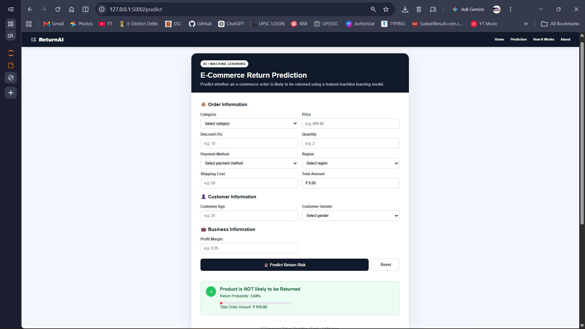

# ReturnSense AI

## AI-Powered E-commerce Return Prediction System

**Predict the probability of an e-commerce order being returned before it happens using Machine Learning.**

ReturnSense AI is an end-to-end Machine Learning application that analyzes order and customer-related information to predict return risk and provide a real-time prediction through a Flask web interface.

---

# Project Overview

Product returns create additional costs for e-commerce businesses through:

* Reverse logistics
* Shipping and handling
* Product inspection
* Restocking
* Refund processing
* Inventory disruption

ReturnSense AI aims to identify orders with a higher probability of being returned so businesses can make better operational and customer-management decisions.

---

# Business Problem

The key business question is:

> **"Can we identify an order that is likely to be returned before the return occurs?"**

A predictive return-risk system can help businesses:

* Identify high-risk orders
* Analyze return patterns
* Reduce avoidable operational costs
* Improve inventory planning
* Support targeted customer interventions
* Improve overall return management

---

# Machine Learning Objective

### Prediction Type

**Binary Classification**

### Target

```text
Return / No Return
```

The trained classification model estimates whether an order is likely to be returned.

---

# Machine Learning Workflow

```text
Raw E-commerce Data
        ↓
Data Cleaning
        ↓
Missing Value Handling
        ↓
Feature Engineering
        ↓
Categorical Encoding
        ↓
Feature Scaling
        ↓
Train/Test Split
        ↓
Classification Models
        ↓
Model Evaluation
        ↓
Best Model Selection
        ↓
Model Serialization
        ↓
Flask Web Application
        ↓
Real-Time Return Prediction
```

---

# Key Features

* Return-risk prediction
* Machine Learning classification
* Data preprocessing pipeline
* Feature encoding and transformation
* Real-time predictions
* Flask-based web interface
* Simple prediction form
* Saved trained model
* Easy local deployment
* Business-oriented prediction output

---

# Model Development

The project follows a structured Machine Learning workflow:

### 1. Data Preparation

* Data inspection
* Data cleaning
* Missing-value treatment
* Duplicate checking
* Data-type validation

### 2. Feature Engineering

Relevant customer, order, product and transaction characteristics are transformed into model-ready features.

### 3. Preprocessing

Categorical variables are encoded and numerical variables are transformed as required by the selected model.

### 4. Model Training

Classification algorithms are evaluated to identify an appropriate model for return prediction.

# Flask Application

The trained Machine Learning model is integrated into a Flask web application.

The application allows a user to enter order/customer information and receive a real-time prediction.

```text
User Input
    ↓
HTML Form
    ↓
Flask Backend
    ↓
Preprocessing
    ↓
Trained ML Model
    ↓
Return Prediction
    ↓
Prediction Result
```

---

# Application Screenshots

## Prediction Interface


## Prediction Result



---

# Project Structure

```text
ReturnSense-AI/
│
├── app.py
├── model/
│   └── trained_model.pkl
│
├── templates/
│   ├── home.html
│   └── result.html
│
├── static/
│   └── style.css
│
├── data/
│   └── dataset.csv
│
├── notebooks/
│   └── ReturnSense_AI.ipynb
│
├── screenshots/
│   ├── home.png
│   └── predication.png
│
├── requirements.txt
└── README.md
```

---

# Technologies Used

### Programming & Data Science

* Python
* Pandas
* NumPy
* Scikit-learn

### Machine Learning

* Classification Algorithms
* Feature Engineering
* Categorical Encoding
* Model Evaluation
* Model Serialization

### Web Development

* Flask
* HTML
* CSS

### Development Tools

* Jupyter Notebook
* GitHub

---

# Installation

## Install Dependencies

```bash
pip install -r requirements.txt
```

## Run the Application

```bash
python app.py
```

Open the local Flask application in your browser.

---

# Business Impact

ReturnSense AI can help e-commerce businesses move from:

```text
Reactive Return Management
            ↓
Predictive Return Risk Management
```

Instead of waiting for returns to happen, businesses can identify potentially high-risk orders and use the prediction as an additional input for operational planning and customer-management decisions.

---

# Future Scope

* Return probability score
* Explainable AI using SHAP
* Model monitoring
* REST API deployment
* Cloud deployment
* Customer-level return risk
* Product-level return analytics
* Return-cost prediction
* Power BI return-risk dashboard
* Automated risk alerts

---

# Project Outcome

ReturnSense AI demonstrates an end-to-end Machine Learning application:

**Data Preparation → Feature Engineering → Classification → Evaluation → Model Deployment → Real-Time Prediction**

The project combines **Machine Learning and Web Development** to convert a predictive model into a usable business application.

---

# Author

**Shivam Shrivastav**

BCA Student | Data Analytics & Machine Learning

If you find this project useful, consider giving the repository a ⭐.
