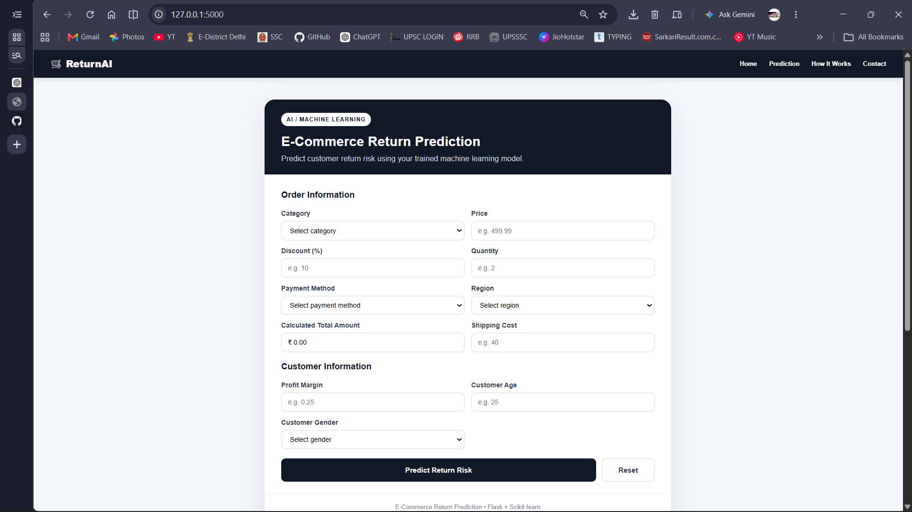
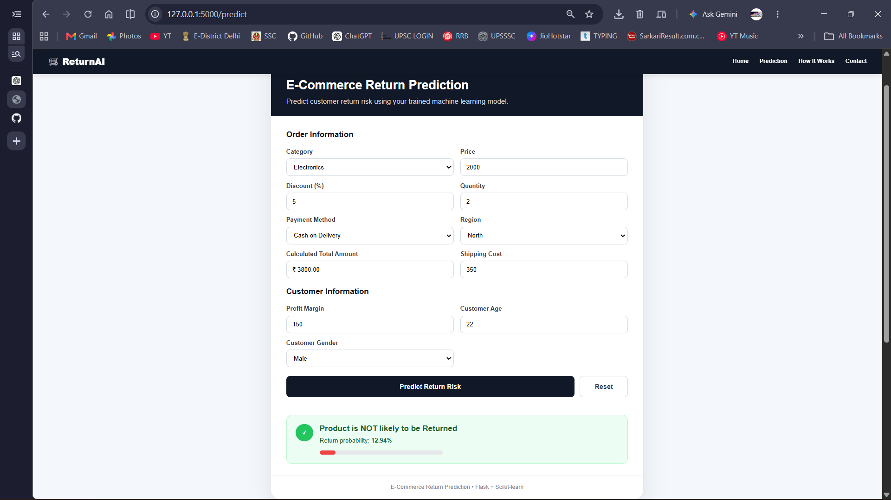

# ReturnSense AI

### AI-Powered E-commerce Return Prediction System

Predict product returns before they happen using Machine Learning, helping e-commerce businesses reduce losses and improve customer satisfaction.

---

## Project Overview

ReturnSense AI is a Machine Learning-based web application that predicts whether an e-commerce order is likely to be returned.

The project combines data preprocessing, classification models, and a Flask web application to provide real-time return predictions.

---

## Features

- Predict product return probability
- User-friendly Flask Web Interface
- Machine Learning Classification Model
- Data Preprocessing Pipeline
- Fast Predictions
- Clean Project Structure
- Easy Deployment

---

## Tech Stack

- Python
- Pandas
- NumPy
- Scikit-learn
- Flask
- HTML
- CSS
- Git
- GitHub

---

## Problem Statement

Product returns are a major challenge in e-commerce.

ReturnSense AI predicts whether an order is likely to be returned before delivery, enabling businesses to make better operational decisions.

---

## License

This project is licensed under the MIT License.

## Application Screenshots

### Prediction Interface

### Prediction Result

## Author
Shivam Shrivastav

BCA Student | Data Analytics & Machine Learning

If you find this project useful, consider giving the repository a star.
